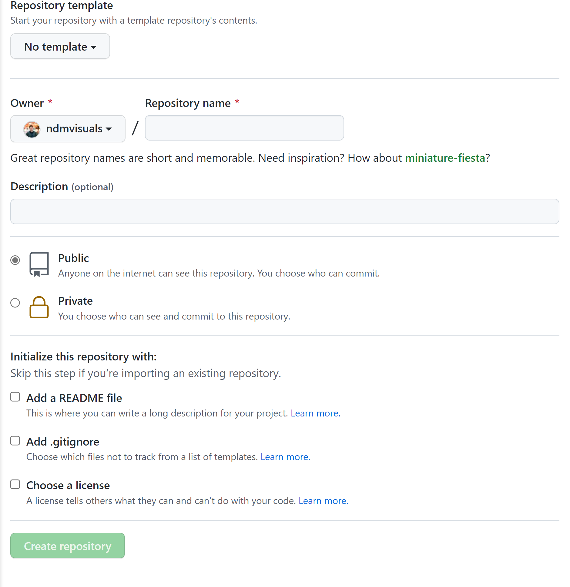

<!-- % GitHub Actions Data Pipeline documentation master file, created by
% sphinx-quickstart on Mon Feb 28 18:59:11 2022.
% You can adapt this file completely to your liking, but it should at least
% contain the root `toctree` directive.
 -->
# Create a data pipeline with GitHub Actions

This tutorial will teach you how to automate basic data collection, analysis and visualization with GitHub Actions.

## About the authors

This guide was prepared for training sessions of Investigative Reporters and Editors (IRE) and the [National Institute for Computer-Assisted Reporting (NICAR)](https://www.ire.org/training/conferences/nicar-2022/) by [Nicholas McMillan](https://www.nickmcmillan.com/) and [Aadit Tambe](https://aadittambe.com/).

## Predule: Prerequisites

You need a free [GitHub account](https://github.com/) to begin this tutorial.

## Act 1: Hello, repo!

A GitHub repository is a place to store your projects files and keep track of the revision history. Keeping track of your revision history means that you can go back to any point in time and see how your project appeared. 

## 1.1. Create a repository

In your profile on [GitHub](https://github.com/), navigate to the "repositories" tab.


Click the green "new" button.

Create a repository name, use dashes instead of spaces.



Select public repository, meaning other people who visit your profile can see it. 

Select “Add a README FILE”: this will be a markdown file where you can write a description for your project.

Select “Add .gitignore”: this is a file where you can tell Git what files to track changes of. For example, it’s best practice to not commit API passwords.

For the .gitignore template, choose Python. This will populate the .gitignore file with common files associated with Python projects that don’t need to be committed to Git history. 


```{warning}
this library is under development.

```
Some text 


an `inline` code block

## here's a code block


```python
for i in myList:
    print(i)
```

## and this is another h2 heading

some more text 

```{toctree}
:caption: 'Contents:'
:maxdepth: 2

usage
```


