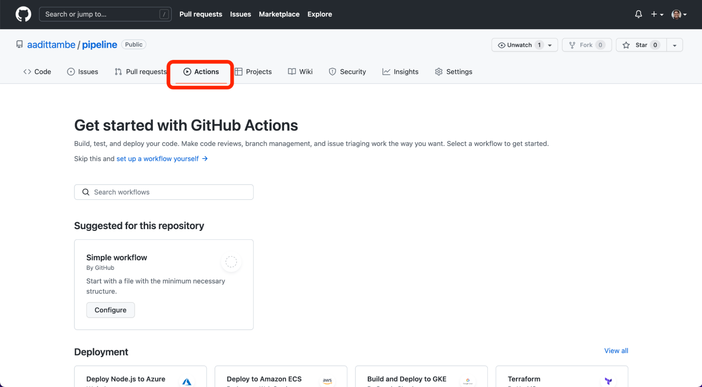
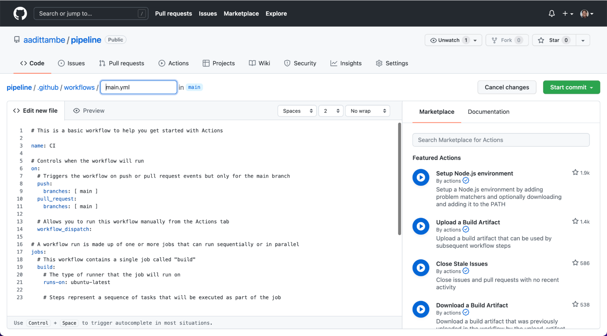
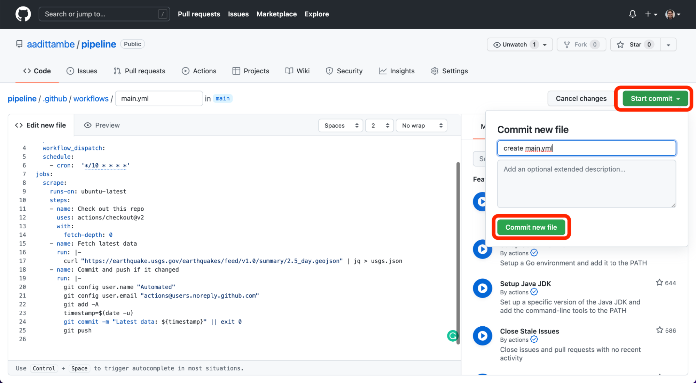

<!-- % GitHub Actions Data Pipeline documentation master file, created by
% sphinx-quickstart on Mon Feb 28 18:59:11 2022.
% You can adapt this file completely to your liking, but it should at least
% contain the root `toctree` directive.
 -->
# Create a data pipeline with GitHub Actions

This tutorial will teach you how to automate basic data collection, analysis and visualization with GitHub Actions.

## About the authors

This guide was prepared for training sessions of Investigative Reporters and Editors (IRE) and the [National Institute for Computer-Assisted Reporting (NICAR)](https://www.ire.org/training/conferences/nicar-2022/) by [Nicholas McMillan](https://www.nickmcmillan.com/) and [Aadit Tambe](https://aadittambe.com/).

## What you will scrape
We are going to build a Git scraper using just a GitHub account and the web browser. We will scrape earthquake data provided by USGS. This records all earthquakes in the past day and is updated every minute. The file can be found at [this](https://earthquake.usgs.gov/earthquakes/feed/v1.0/csv.php) page, and [this](https://earthquake.usgs.gov/earthquakes/feed/v1.0/summary/all_day.csv) is the download link.


We have a two-part goal here:
- We are first going to use GitHub to scrape this file every 5 minutes, and overwrite it each time. 
- Then, we are going to execute a Python script to bind the new data to a main file, so that we bind and save our data. 

## Predule: Prerequisites

You need a free [GitHub account](https://github.com/) to begin this tutorial.

## Act 1: Hello, repository!

This chapter will walk you through how to create a repository. A GitHub repository is a place to store your projects files and keep track of the revision history. Keeping track of your revision history means that you can go back to any point in time and see how your project appeared. 

In your profile on [GitHub](https://github.com/), navigate to the "repositories" tab.


Click the green "new" button.

Create a repository name, use dashes instead of spaces.


Select public repository, meaning other people who visit your profile can see it. 

Select “Add a README FILE”: this will be a markdown file where you can write a description for your project.

Select “Add .gitignore”: this is a file where you can tell Git what files to track changes of. For example, it’s best practice to not commit API passwords.

For the .gitignore template, choose Python. This will populate the .gitignore file with common files associated with Python projects that don’t need to be committed to Git history. 

## Act 2: Create an Actions workflow

This chapter will walk you through how to create a GitHub Action that executes a script to fetch data on a schedule.

### 2.1. Create an Action file

In your repository, click on the “Actions” tab.



Once you’re in the “Actions” tab, click on “set up a workflow yourself.”


You will be directed to a YAML file, with a screen that looks like this: 



### 2.2. Write the workflow

In this file, we will write step-by-step instructions for GitHub to execute commands. GitHub Actions uses [YAML](https://en.wikipedia.org/wiki/YAML) syntax to define the workflow. Delete everything in the file, and paste the text from here into the file.

```yaml
name: Scrape latest data
on:
  push:
  workflow_dispatch:
  schedule:
    - cron:  '*/10 * * * *'
jobs:
  scrape:
    runs-on: ubuntu-latest
    steps:
    - name: Check out this repo
      uses: actions/checkout@v2
      with:
        fetch-depth: 0
    - name: Fetch latest data
      run: |-
        cURL "https://earthquake.usgs.gov/earthquakes/feed/v1.0/summary/2.5_day.geojson" | jq > usgs.json
    - name: Commit and push if it changed
      run: |-
        git config user.name "Automated"
        git config user.email "actions@users.noreply.github.com"
        git add -A
        timestamp=$(date -u)
        git commit -m "Latest data: ${timestamp}" || exit 0
        git push
```

### 2.3. Understand the Action

GitHub calls this a “workflow.” It is a set of instructions written in a language called YAML that tells GitHub which commands to execute. 

The `name` keyword denotes an optional name given to the workflow. 

The `on` keyword specifies the trigger for this workflow — it’s currently set to run based on a cron trigger every time you “push” code to the repository, or when you click a manual button, denoted by “workflow_dispatch.”

The `jobs` keyword groups together all the commands that the Action will execute. We have called our “job” `scrape`.
The `runs-on` keyword configures the job to run on the latest version of an Ubuntu Linux runner. This means that the job will execute on a fresh virtual machine hosted by GitHub. 

The `name` keyword lets you give an optional name to the step.

The `uses` keyword specifies that this step will run v2 of the actions/checkout action. This is an action that checks out our repository onto the runner, allowing us to run scripts or other actions against your code (such as build and test tools).

The `run` keyword tells the job to execute a command on the runner. In this `run`, the Action will download that earthquake file using the cURL tool, then pipe it through jq in order to pretty-print the JSON - this makes for a more useful display of file differences.

Then, we commit the results to our repository and push them, in the next step.

### 2.4. Save the file

Save this file ... and you’re done! You’ve written a scraper that runs automatically every 10 minutes. 




### 2.5. Watch the Action run and log results in the repository

tktktktktktktktk

## Act 3: Hello, analysis!

This step will walk you through automating basic analysis using a Python notebook that's connected to GitHub Actions.

### 3.1. Create notebook

Open up the google collab notebook [here]().

First push `File` and then `Save a copy in Github`.


Choose the appropriate repository to commit the file to and then push `OK`.


### 3.2. View the notebook commited to your repository

Now, whenever you need to edit this Collab notebook, you can push the `Open in Collab` badge.


### 3.3. Connect scraped data to notebook

Connect the data scraped in your repository to the Colab notebook.

In your repository, click on the `usgs.json` file.


Then, click the three dots and then `View raw`.


This URL points to the raw json data. Copy the URL and paste it in the `URL` variable in the notebook


tktk


```
  display: block;
  margin-left: auto;
  margin-right: auto;
  width: 50%;
```

Now we need to commit our analysis notebook to our GitHub, repeat step 4.1


```{warning}
this library is under development.

```
Some text 


an `inline` code block

## here's a code block


```python
for i in myList:
    print(i)
```

## and this is another h2 heading

some more text 

```{toctree}
:caption: 'Contents:'
:maxdepth: 2

usage
```


