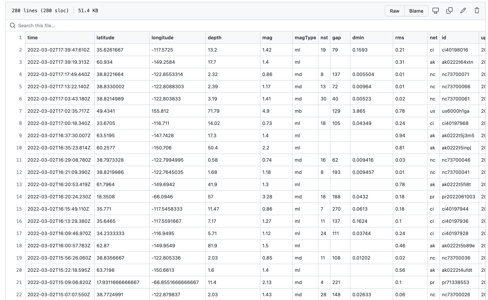
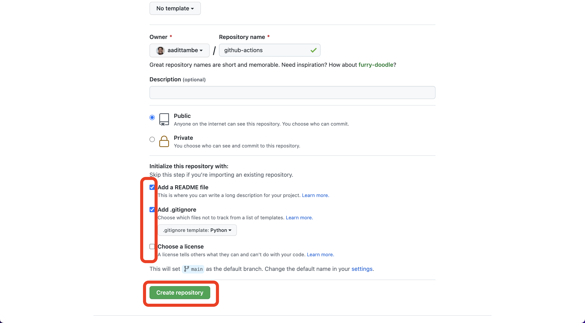
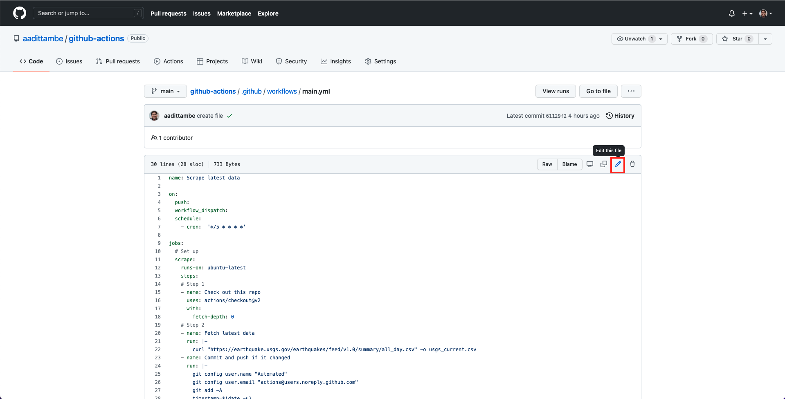

# Building a data pipeline with GitHub Actions

This tutorial will teach you how to automate basic data collection and analysis with GitHub Actions.

## About the authors

This guide was prepared for training sessions of Investigative Reporters and Editors (IRE) and the [National Institute for Computer-Assisted Reporting (NICAR)](https://www.ire.org/training/conferences/nicar-2022/) by [Nicholas McMillan](https://www.nickmcmillan.com/) and [Aadit Tambe](https://aadittambe.com/). This guide draws inspiration from a [Git scraping course](https://docs.google.com/document/u/0/d/1TCatZP5gQNfFjZJ5M77wMlf9u_05Z3BZnjp6t1SA6UU/mobilebasic#h.9d9m67inr5k4) originally designed by [Simon Willison](simonwillison.net) to be taught at NICAR.

## What you will scrape
We are going to build a Git scraper using just a GitHub account and the web browser. We will scrape earthquake data provided by USGS. This records all earthquakes in the past day and is updated every minute. The file can be found at [this](https://earthquake.usgs.gov/earthquakes/feed/v1.0/csv.php) page, and [this](https://earthquake.usgs.gov/earthquakes/feed/v1.0/summary/all_day.csv) is the download link.


We have a two-part goal here:
- We are first going to use GitHub to scrape this file every 5 minutes, and overwrite it each time. 
- Then, we are going to execute a Python script to bind the new data to a main file, so that we bind and save our data. 

At the end of this tutorial, your repository will have — and be updating — two files: 
- a `usgs_current.csv` file that has the current data scraped from the USGS website. 
- a `usgs_main.csv` file that stores all the data since you began scraping.




## Predule: Prerequisites

You need a free [GitHub account](https://github.com/) to begin this tutorial.

## Act 1: Hello, repository!

This chapter will walk you through how to create a repository. A GitHub repository is a place to store your projects files and keep track of the revision history. Keeping track of your revision history means that you can go back to any point in time and see how your project appeared. 

In your profile on [GitHub](https://github.com/), navigate to the "repositories" tab and click the green "new" button.


Create a repository name — make sure to use dashes instead of spaces.

Select public repository, meaning other people who visit your profile can see it. 

Select “Add a README FILE”: this will be a markdown file where you can write a description for your project.

Select “Add .gitignore”: this is a file where you can tell Git what files to track changes of. For example, it’s best practice to not commit API passwords.

For the .gitignore template, choose Python. This will populate the .gitignore file with common files associated with Python projects that don’t need to be committed to Git history. 



## Act 2: Hello, Action!

This chapter will walk you through how to create a GitHub Action that executes a script to fetch data on a schedule.

### 2.1. Create an Action file

In your repository, click on the “Actions” tab.


Once you’re in the “Actions” tab, click on “set up a workflow yourself.”


You will be directed to a YAML file, with a screen that looks like this: 


### 2.2. Write the workflow

In this file, we will write step-by-step instructions for GitHub to execute commands. GitHub Actions uses [YAML](https://en.wikipedia.org/wiki/YAML) syntax to define the workflow. Delete everything in the file, and paste the text from here into the file.

```yaml
name: Scrape latest data

on:
  push:
  workflow_dispatch:
  schedule:
    - cron:  '*/5 * * * *'

jobs:
  # Set up
  scrape:
    runs-on: ubuntu-latest
    steps:
    # Step 1: Prepare the environment
    - name: Check out this repo
      uses: actions/checkout@v2
      with:
        fetch-depth: 0
    # Step 2: Get the latest data and store it as a CSV
    - name: Fetch latest data
      run: |-        
        curl "https://earthquake.usgs.gov/earthquakes/feed/v1.0/summary/all_day.csv" -o usgs_current.csv
    - name: Commit and push if it changed
      run: |-
        git config user.name "Automated"
        git config user.email "actions@users.noreply.github.com"
        git add -A
        timestamp=$(date -u)
        git commit -m "Latest data: ${timestamp}" || exit 0
        git push
```

### 2.3. Understand the Action

GitHub calls this a “workflow.” It is a set of instructions written in a language called YAML that tells GitHub which commands to execute. 

The `name` keyword denotes an optional name given to the workflow. 

The `on` keyword specifies the trigger for this workflow — it’s currently set to run based on a cron trigger every time you “push” code to the repository, or when you click a manual button, denoted by “workflow_dispatch.”

The `jobs` keyword groups together all the commands that the Action will execute. We have called our “job” `scrape`.
The `runs-on` keyword configures the job to run on the latest version of an Ubuntu Linux runner. This means that the job will execute on a fresh virtual machine hosted by GitHub. 

The `name` keyword lets you give an optional name to the step.

The `uses` keyword specifies that this step will run v2 of the actions/checkout action. This is an action that checks out our repository onto the runner, allowing us to run scripts or other actions against your code (such as build and test tools).

The `run` keyword tells the job to execute a command on the runner. In this `run`, the Action will download that earthquake file using the cURL tool - this makes for a more useful display of file differences.

Then, we commit the results to our repository and push them, in the next step.

### 2.4. Save the file

Save this file. Click on the green box "Start commit", enter a commit message such as "created file," and click on "commit new file." You’re done! You’ve written a scraper that runs automatically every 5 minutes. 


### 2.5. Watch the Action run and log results in the repository

Wait a second or two, and navigate back to the "code" tab of your repository. You will notice a newly created `usgs_current.csv` file.


## Act 3: Hello, Python!

We have downloaded the CSV file from USGS, however, every time that the Action runs, this file is going to be overwritten by a new one. In this lesson, you will learn how to introduce a short Python script to the Action workflow that takes a new CSV and adds its new rows to a "main" CSV that we will create. This way, you will keep storing data, instead of overwriting the same file.

### 3.1. Create a Python file from the GitHub repository

From your repository, click on the "Add file" button and then "Create new file" button. 


Let's call this script `get_all_data.py`. Paste the following code in the file:

```python
import pandas as pd # import pandas library for data manipulation and analysis
import requests # import requests library to send HTTP requests using Python
import json # import json library to handle json files
from pathlib import Path # import path library to work with file paths

df_current = pd.read_csv('usgs_current.csv')

path = Path("usgs_main.csv")

if path.is_file() == False:
  # if false, save initial main file  
  df_current.to_csv("usgs_main.csv")

else:
  # if the file already exists, save it to a dataframe and then append to a new one    
  df_main_old = pd.read_csv("usgs_main.csv")
  df_main_new = pd.concat([df_main_old,df_current])

  # deduplicate based on unique id
  df_main_new_drop_dupes = df_main_new.drop_duplicates(subset = "id", keep = "first")

  # save to dataframe and overwrite the old usgs_main file
  df_main_new_drop_dupes.to_csv("usgs_main.csv")
```

Give it a commit message — something like "create python script" — and push the `Commit new file` button.


### 3.2. Understand the Python script

In the Python script, we are first importing libraries that will help us create the file called `usgs_main.csv`. These libraries include `pandas`, `requests`, `json` and `pathlib`.

Then, we will load in the `usgs_current.csv` file, as `df_current`. This file is the one that is being overwritten each time our Action runs. 

Then, we are creating a `usgs_main.csv` file, the first time this script runs. Every time the script runs after that, we are binding the "current" CSV, `usgs_current.csv` to our "main" CSV, `usgs_main.csv`.

Then, we are dropping duplicate rows from the "main" CSV, such that if there is an overlap between data that is scraped, the `usgs_main.csv` will only have unique rows.

### 3.2. Add the Python script to the workflow file

In your GitHub repository, click on the folder `.github/workflows`.


Then, click on the `main.yml` file.


Then, click on the "pencil" icon to edit the file.



In the file, we are going to add steps to execute the Python script we just saved immediately after the scraper runs. 

Add steps 3 and 4 (as shown below) to the workflow file, after step 2 and before committing and pushing. The complete workflow file will look like this: 

```yaml
name: Scrape latest data

on:
  push:
  workflow_dispatch:
  schedule:
    - cron:  '*/5 * * * *'

jobs:
  # Set up
  scrape:
    runs-on: ubuntu-latest
    steps:
    # Step 1
    - name: Check out this repo
      uses: actions/checkout@v2
      with:
        fetch-depth: 0
    # Step 2
    - name: Fetch latest data
      run: |-        
        curl "https://earthquake.usgs.gov/earthquakes/feed/v1.0/summary/all_day.csv" -o usgs_current.csv
    # Step 3
    - name: Install requirements
      run: python -m pip install requests pandas jupyterlab
    # Step 4    
    - name: Run script to create main csv
      run: python get_all_data.py     
    # Step 5
    - name: Commit and push if it changed
      run: |-
        git config user.name "Automated"
        git config user.email "actions@users.noreply.github.com"
        git add -A
        timestamp=$(date -u)
        git commit -m "Latest data: ${timestamp}" || exit 0
        git push

```

In step 3, we are asking the Actions workflow to install some requirements — the libraries our Python script used — to the virtual machine running the Action. 

In step 4, we are are asking the workflow to run our Python script `get_all_data.py`, much like you would execute a Python script from the command line. 

Step 5 is the same as before, where we `add`, `commit` and `push` our changes.

Let's commit this file. Push the green `start commit` button, then write a message, something like "update main.yml," and push the `commit changes` button.


### 3.3. Watch the workflow run

Navigate back to `code` tab of your repository. And notice the newly created `usgs_main.csv` file. Every time our scraper runs, it will add rows to this file.


## Epilogue: Hello, analysis!

Now that we are downloading the most current CSV (`usgs_current.csv`) and also aggregating all the data we collect (`usgs_main.csv`), we can run some basic analysis on the file.

In our GitHub repository, click on the `usgs_main.csv` file.


Then, click on the `Raw` button.


This will bring you to the "raw" CSV, that looks like this: 


We will be using this CSV (and the URL to this CSV, in particular) for our analysis of data. The URL to this raw CSV will always remain the same, until you move the file to another directory, even if the CSV updates.

```{note}
This URL can be used to load the CSV data into a JavaScript visualization — using libraries such as D3 or Chart.js. The visualizations will update in real time as the data changes. 
```

Next, make a copy of [this notebook](https://colab.research.google.com/github/aadittambe/actions-pipeline/blob/main/usgs_analysis.ipynb).

After opening the file, click "File" and then "Save a copy in Drive." This will save the notebook in your Google Drive, so you can edit the code and save the changes.


If you push the "play" button next to a code chunk, that will execute the code. Since it's a notebook, it will return the result of each step right after the code chunk.

First, we load all the libraries our analysis will require. Then, we load the `usgs_main.csv` file using the `raw` GitHub link. This means every time data updates, we can run this same file and get an updated result.

This notebook runs simple Python code that performs basic summarizing and grouping actions to print two sentences:
- one that prints the most recent earthquake and the strongest earthquake
- another that prints the earthquake with the highest magnitude

```{note}
To learn more about getting started with Python notebooks using an a browser-based notebook called a Jupyter notebook, check out [this](https://www.firstpythonnotebook.org/about/index.html) textbook made for another NICAR class.
```

This notebook can be modified with code to run advanced analysis on the data we scraped, or any other data set using a `raw` GitHub files.